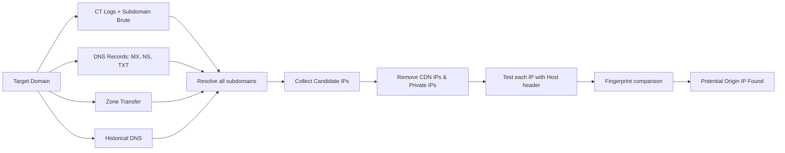

```markdown
# 🚀 GetReal IP - Advanced CDN Origin IP Finder

<p align="center">
  
  
  
</p>

<p align="center">
  <strong>Discover the real origin IP behind CDN, reverse proxies, and protected infrastructures.</strong><br>
  <em>Even behind Cloudflare, Akamai, Fastly, Netlify, and more.</em>
</p>

---

## ✨ Overview

**GetReal IP** is an advanced reconnaissance tool designed to identify potential origin IP addresses hidden behind CDN providers such as Cloudflare, Akamai, Fastly, CloudFront, Netlify, and similar protection layers.

Unlike many existing solutions that rely heavily on paid intelligence platforms, **GetReal IP can successfully discover origin IPs even without API keys** by leveraging:

* Certificate Transparency Logs (crt.sh)
* Subdomain Enumeration (including light brute-force)
* DNS Resolution Analysis
* Historical DNS Data (Wayback Machine)
* MX, NS, TXT Record Analysis
* DNS Zone Transfer (AXFR) – if misconfigured
* Direct Origin Validation via Host Header
* Response Fingerprinting & Similarity Matching
* SSL Certificate SAN extraction

For users with access to external intelligence providers, API support for **Shodan** and **Censys** is also available to further enhance detection capabilities.

---

## 🎯 Key Features

### 🔥 Works Without API Keys

Most origin discovery tools depend entirely on services like Shodan or Censys.

**GetReal IP does not.**

Even with zero API configuration, the tool performs:

* CT Log Mining
* Subdomain Discovery (from crt.sh + common wordlist)
* DNS Correlation (MX, NS, TXT)
* Historical IP extraction (Wayback Machine)
* Zone Transfer attempts
* SSL certificate IP extraction
* Candidate IP Enumeration
* Direct Origin Verification (HTTP/HTTPS)

to maximize the chance of identifying the real backend server.

---

### ⚡ Optional Intelligence Integration

For deeper investigations, you can optionally provide:

* Censys API Credentials
* Shodan API Key

to enrich the discovery process.

---

### 🧠 Advanced Techniques

| Technique | Description |
|-----------|-------------|
| **ASN Enumeration** | If a candidate IP is found, the tool can expand to all IPs in the same ASN (slow but powerful). |
| **Tor Support** | Use Tor proxy to avoid rate limiting and IP bans. |
| **Brute-Force Subdomains** | Over 150 common subdomains are tested. |
| **DNS Zone Transfer** | Attempts AXFR against authoritative name servers. |
| **Historical DNS** | Queries Wayback Machine for past A records. |
| **MX/NS/TXT Parsing** | Extracts IP addresses from email, nameserver, and text records. |
| **SSL SAN Extraction** | Grabs IP addresses from Subject Alternative Names. |

---

## 🏗 How It Works



---

## 🔍 Discovery Workflow

| Phase                 | Description |
| --------------------- | -------------------------------------------------- |
| CT Logs Mining        | Extract subdomains from certificate transparency logs |
| Subdomain Brute       | Test common subdomains (www, mail, api, admin, etc.) |
| DNS Record Analysis   | Query MX, NS, TXT records for IP clues |
| Zone Transfer         | Attempt AXFR against each nameserver |
| Historical DNS        | Retrieve past A records from Wayback Machine |
| SSL SAN Parsing       | Extract IP addresses from certificate SAN fields |
| Candidate Collection  | Build IP candidate list (global IPs only) |
| Direct Validation     | Test candidates using Host header (HTTP + HTTPS) |
| Similarity Matching   | Compare response status, headers, and body content |
| ASN Expansion (opt)   | If enabled, fetch all IPs from matched ASNs |
| Origin Detection      | Report probable backend servers |

---

## 📦 Installation

### Clone Repository

```bash
git clone https://github.com/sayhellotohacker/GetReal-IP.git
cd GetReal-IP
```

### Install Dependencies

```bash
pip install -r requirements.txt
```

Or manually:

```bash
pip install requests dnspython colorama pysocks urllib3 pyOpenSSL
```

> **Note:** On Linux, you may also need `dnsutils` for some advanced DNS queries (optional):
> ```bash
> sudo apt install dnsutils
> ```

---

## 🚀 Usage

### Basic Scan (No API Keys)

```bash
python3 getreal.py example.com
```

### Using Shodan

```bash
python3 getreal.py example.com --shodan-key YOUR_SHODAN_KEY
```

### Using Censys

```bash
python3 getreal.py example.com --censys-id YOUR_CENSYS_ID --censys-secret YOUR_CENSYS_SECRET
```

### Using Tor Proxy (requires Tor running on 127.0.0.1:9050)

```bash
python3 getreal.py example.com --tor
```

### ASN Enumeration (slow but thorough)

```bash
python3 getreal.py example.com --asn-enum --threads 50
```

### Combine Everything

```bash
python3 getreal.py example.com \
  --shodan-key KEY \
  --censys-id ID \
  --censys-secret SECRET \
  --tor \
  --asn-enum \
  --threads 100
```

---

## 📊 Example Output

```text
[+] Current resolved IPs: 104.18.24.10, 104.18.25.10
[!] CDN Detected: CLOUDFLARE

[*] Querying crt.sh for certificates (full history)...
[+] Found 142 subdomains from crt.sh

[*] Querying Wayback Machine for historical DNS A records...
[+] Retrieved 12 historical IPs

[*] Checking MX, NS, TXT records for IP clues...
[+] Extracted 8 IPs from DNS records

[*] Attempting DNS zone transfer (AXFR)...
[-] Zone transfer failed

[*] Brute-forcing common subdomains...
[+] Brute-forced 23 subdomains

[*] Total candidate IPs to test: 67

[+] Testing candidate IPs (HTTPS + Host header)...
[!!!] Potential Origin: 203.0.113.45 (Status: 200, via https)
[!!!] Potential Origin: 198.51.100.22 (Status: 403, via https)

[+] Saved 2 potential origin IPs to example.com_origin_ips.txt
```

---

## 💡 Why GetReal IP?

| Feature                         | GetReal IP | Typical Tools |
| ------------------------------- | ---------- | ------------- |
| Works Without API Keys          | ✅          | ❌             |
| CT Log Enumeration              | ✅          | ⚠️            |
| Subdomain Brute-Force           | ✅          | ⚠️            |
| MX/NS/TXT Analysis              | ✅          | ❌             |
| Zone Transfer                   | ✅          | ❌             |
| Historical DNS (Wayback)        | ✅          | ❌             |
| SSL SAN IP Extraction           | ✅          | ❌             |
| ASN Enumeration                 | ✅ (opt)    | ❌             |
| Tor Support                     | ✅          | ❌             |
| Direct Origin Testing           | ✅          | ❌             |
| Response Similarity Matching    | ✅          | ⚠️            |
| Optional Shodan/Censys Support  | ✅          | ✅             |
| Lightweight & Fast              | ✅          | ❌             |

---

## ⚠️ Disclaimer

This project is intended for:

* Security Research
* Authorized Penetration Testing
* Infrastructure Auditing
* Educational Purposes

Users are responsible for complying with all applicable laws and obtaining proper authorization before testing any systems.

---

## 🛠 Future Improvements

- [x] ASN Correlation (implemented)
- [x] Tor Proxy Support
- [x] Historical DNS (Wayback)
- [x] MX/NS/TXT Parsing
- [x] Zone Transfer Attempts
- [x] Brute-Force Subdomains
- [ ] Passive DNS APIs (SecurityTrails, etc.)
- [ ] Screenshot Verification
- [ ] More CDN fingerprints
- [ ] gRPC endpoint testing

---

## ⭐ Support

If this project helps you during assessments or research, consider giving it a star ⭐ on GitHub.

Contributions, ideas, and pull requests are always welcome.
