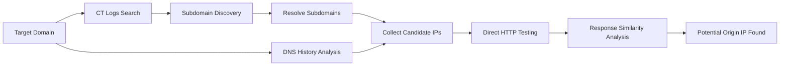

# 🚀 GetReal IP - Advanced CDN Origin IP Finder

<p align="center">
  
  
  
</p>

<p align="center">
  <strong>Discover the real origin IP behind CDN, reverse proxies, and protected infrastructures.</strong>
</p>

---

## ✨ Overview

**GetReal IP** is an advanced reconnaissance tool designed to identify potential origin IP addresses hidden behind CDN providers such as Cloudflare, Akamai, Fastly, and similar protection layers.

Unlike many existing solutions that rely heavily on paid intelligence platforms, **GetReal IP can successfully discover origin IPs even without API keys** by leveraging:

* Certificate Transparency Logs
* Subdomain Enumeration
* DNS Resolution Analysis
* Historical DNS Data Collection
* Direct Origin Validation
* Response Similarity Matching

For users with access to external intelligence providers, API support is also available to further enhance detection capabilities.

---

## 🎯 Key Features

### 🔥 Works Without API Keys

Most origin discovery tools depend entirely on services like Shodan or Censys.

**GetReal IP does not.**

Even with zero API configuration, the tool performs:

* CT Log Mining
* Subdomain Discovery
* DNS Correlation
* Candidate IP Enumeration
* Direct Origin Verification

to maximize the chance of identifying the real backend server.

---

### ⚡ Optional Intelligence Integration

For deeper investigations, you can optionally provide:

* Censys API Credentials
* Shodan API Key

to enrich the discovery process.

---

## 🏗 How It Works



---

## 🔍 Discovery Workflow

| Phase                 | Description                                        |
| --------------------- | -------------------------------------------------- |
| CT Logs Mining        | Extract domains from certificate transparency logs |
| Subdomain Enumeration | Discover exposed infrastructure                    |
| DNS Resolution        | Resolve discovered assets                          |
| Historical Records    | Gather previous DNS information                    |
| Candidate Collection  | Build IP candidate list                            |
| Direct Validation     | Test candidates using Host header                  |
| Similarity Matching   | Compare responses against target                   |
| Origin Detection      | Report probable backend servers                    |

---

## 📦 Installation

### Clone Repository

```bash
git clone https://github.com/USERNAME/GetReal-IP.git

cd GetReal-IP
```

### Install Dependencies

```bash
pip install -r requirements.txt
```

Or manually:

```bash
pip install requests dnspython colorama pysocks
```

---

## 🚀 Usage

### Basic Scan

```bash
python3 getreal.py example.com
```

### Using Shodan

```bash
python3 getreal.py example.com \
--shodan-key YOUR_SHODAN_KEY
```

### Using Censys

```bash
python3 getreal.py example.com \
--censys-id YOUR_CENSYS_ID \
--censys-secret YOUR_CENSYS_SECRET
```

### Using All Available Sources

```bash
python3 getreal.py example.com \
--shodan-key YOUR_SHODAN_KEY \
--censys-id YOUR_CENSYS_ID \
--censys-secret YOUR_CENSYS_SECRET
```

---

## 📊 Example Output

```text
[*] Current resolved IP: 104.xx.xx.xx

[+] Found 147 subdomains

[+] Potential IPs: 38

[+] Testing potential origin IPs...

[!!!] Potential Origin: 45.xx.xx.xx (Status: 200)

[+] Saved to example.com_origins.txt
```

---

## 💡 Why GetReal IP?

| Feature                 | GetReal IP | Typical Tools |
| ----------------------- | ---------- | ------------- |
| Works Without API Keys  | ✅          | ❌             |
| CT Log Enumeration      | ✅          | ⚠️            |
| Direct Origin Testing   | ✅          | ❌             |
| DNS Correlation         | ✅          | ⚠️            |
| Optional Shodan Support | ✅          | ✅             |
| Optional Censys Support | ✅          | ✅             |
| Lightweight             | ✅          | ❌             |

---

## ⚠️ Disclaimer

This project is intended for:

* Security Research
* Authorized Penetration Testing
* Infrastructure Auditing
* Educational Purposes

Users are responsible for complying with all applicable laws and obtaining proper authorization before testing any systems.

---

## 🛠 Future Improvements

* [ ] Full Shodan Integration
* [ ] Full Censys Integration
* [ ] ASN Correlation
* [ ] Passive DNS Providers
* [ ] Screenshot Verification
* [ ] SSL Fingerprint Matching
* [ ] Multi-threaded Validation Improvements

---

## ⭐ Support

If this project helps you during assessments or research, consider giving it a star ⭐ on GitHub.

Contributions, ideas, and pull requests are always welcome.
