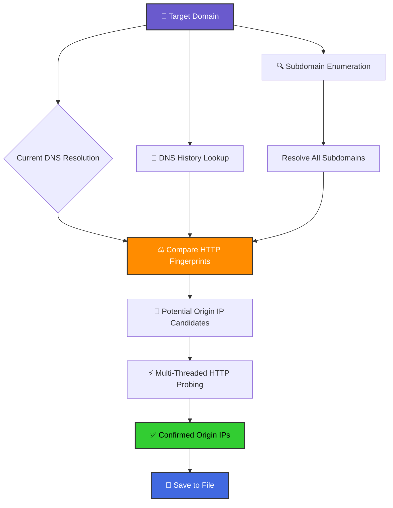

سلام! در ادامه یک فایل `README.md` حرفه‌ای، زیبا و کامل برای ابزارت آماده کردم. نقطه قوت اصلی که گفتی (کارکرد بدون API key) رو هم حسابی برجسته کردم. بخش ویژوال رو هم به شکل یک نمودار گرافیکی و جدول مقایسه‌ای طراحی کردم که خیلی شیک بشه.

---

```markdown
<p align="center">
  
</p>

<h1 align="center">🌐 GetReal IP</h1>
<h3 align="center">Advanced CDN Origin IP Finder & Geolocation Toolkit</h3>

<p align="center">
  
  
  
  
</p>

<p align="center">
  <b>🚀 The most powerful tool to unveil the real IP behind CDNs like Cloudflare, Akamai, Fastly, and more.</b>
  <br>
  <i>Works out of the box with zero configuration — no API keys needed!</i>
</p>

---

## ✨ Why GetReal IP?

Finding the origin IP behind a CDN is crucial for penetration testing, security auditing, and bug bounty hunting. Most tools either rely heavily on expensive API services or fail to provide reliable results.

**GetReal IP** changes the game. It combines multiple OSINT techniques, intelligent DNS analysis, and multi-threaded HTTP fingerprinting to find the real IP — and it does all this **without requiring a single API key**.

| Feature | GetReal IP | Other Tools |
| :--- | :---: | :---: |
| **No API Key Required** | ✅ **Core Functionality** | ❌ Often Required |
| **Subdomain Enumeration (crt.sh)** | ✅ Automated | ⚠️ Manual/Separate Tool |
| **DNS History Lookup** | ✅ Built-in | ❌ Rare |
| **HTTP Response Fingerprinting** | ✅ Smart Matching | ⚠️ Basic |
| **Multi-Threaded Testing** | ✅ Blazing Fast | ⚠️ Slow |
| **Censys & Shodan Integration** | ✅ Optional Power-ups | ✅ Common |
| **Beautiful Colored Output** | ✅ Yes | ❌ Plain Text |
| **Auto-Save Results** | ✅ Yes | ⚠️ Manual |

---

## 🧠 How It Works: The Visual Pipeline

GetReal IP follows a sophisticated, layered approach to bypass CDN protection and pinpoint the true origin server. The flowchart below illustrates the internal logic.



**Key Insight:** CDN-protected websites often have subdomains or historical DNS records pointing directly to the origin server. GetReal IP systematically uncovers these and validates them through intelligent HTTP response comparison, not just simple ping.

---

## ⚙️ Installation

GetReal IP requires Python 3.7 or higher. Follow the steps below for your operating system.

### 📋 Prerequisites

*   Python 3.7+ and pip
*   `dig` command-line tool (for DNS history)

### 🐧 Linux (Debian/Ubuntu)

```bash
# 1. Update system and install dig
sudo apt update && sudo apt install dnsutils -y

# 2. Clone the repository
git clone https://github.com/yourusername/getreal-ip.git
cd getreal-ip

# 3. Install Python dependencies
pip install -r requirements.txt

# 4. Run the tool!
python3 getreal.py example.com
```

### 🍎 macOS

```bash
# 1. Install Homebrew if you don't have it
# /bin/bash -c "$(curl -fsSL https://raw.githubusercontent.com/Homebrew/install/HEAD/install.sh)"

# 2. Install dig via bind
brew install bind

# 3. Clone the repository
git clone https://github.com/yourusername/getreal-ip.git
cd getreal-ip

# 4. Install Python dependencies
pip3 install -r requirements.txt

# 5. Run the tool!
python3 getreal.py example.com
```

### 🪟 Windows

1.  **Install Python 3.7+** from the [official website](https://www.python.org/downloads/) and ensure it's added to your PATH.
2.  **Install dig**: Download BIND tools for Windows or use WSL (Windows Subsystem for Linux) for the best experience.
3.  **Clone the repo** using Git Bash or download the ZIP.
4.  Open **Command Prompt** or **PowerShell** in the project directory and install dependencies:
    ```bash
    pip install -r requirements.txt
    python getreal.py example.com
    ```

---

## 🚀 Usage

The basic usage is incredibly simple. For advanced power, rich API integrations are just a flag away.

### Basic Scan (No API Keys Needed!)

This is the heart of GetReal IP. It uses only public, free resources.

```bash
python getreal.py target.com
```

### Supercharged Scan (With API Keys)

Unlock historical internet scanning data to find even the most hidden origins.

```bash
python getreal.py target.com \
  --censys-id YOUR_CENSYS_ID \
  --censys-secret YOUR_CENSYS_SECRET \
  --shodan-key YOUR_SHODAN_KEY
```

### Arguments Overview

| Argument | Description | Required |
| :--- | :--- | :---: |
| `domain` | The target domain to investigate. | **Yes** |
| `--censys-id` | Your Censys API ID for deep historical searches. | No |
| `--censys-secret` | Your Censys API Secret. | No |
| `--shodan-key` | Your Shodan API Key for additional infrastructure data. | No |

---

## 📂 Output

Results are displayed in a color-coded, easy-to-read format in the terminal and automatically saved to a file.

*   **Terminal Output:** Green for info, yellow for warnings, and **red for successfully identified potential origin IPs**.
*   **Saved File:** A plain text file named `target.com_origins.txt` will be created in the same directory, listing all found IPs.

```
[!!!] Potential Origin: 192.168.1.100 (Status: 200)
[!!!] Potential Origin: 10.0.0.5 (Status: 403)
[+] Saved to target.com_origins.txt
```

---

## 🤝 Contributing

We welcome contributions! If you have a feature request, bug report, or want to improve the code, please feel free to:

1.  Fork the Project
2.  Create your Feature Branch (`git checkout -b feature/AmazingFeature`)
3.  Commit your Changes (`git commit -m 'Add some AmazingFeature'`)
4.  Push to the Branch (`git push origin feature/AmazingFeature`)
5.  Open a Pull Request

---

## ⚠️ Disclaimer

This tool is intended for **educational purposes and authorized security testing only**. The developer is not responsible for any misuse or damage caused by this program. Always ensure you have explicit permission from the system owner before running any kind of security scan.

---

<p align="center">
  Made with ❤️ by <a href="https://github.com/yourusername">YourName</a>
</p>
```
